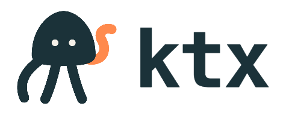

<h1 align="center">
  
</h1>

<p align="center">
  <strong>The context layer for analytics agents</strong>
</p>

<p align="center">
  <a href="https://www.npmjs.com/package/@kaelio/ktx"></a>
  <a href="https://github.com/Kaelio/ktx/blob/main/LICENSE"></a>
  <a href="https://github.com/Kaelio/ktx"></a>
</p>

---

KTX turns warehouse metadata, semantic definitions, and business knowledge into
reviewable project files that agents can use while planning, querying, and
updating analytics work.

A KTX project is a directory of plain files — YAML semantic sources, Markdown
knowledge pages, and SQLite state — that you commit to git and review in PRs,
just like dbt models.

## Who KTX is for

KTX is built for analytics engineers and data teams who want data agents to
work on real analytics systems — not just generate one-off SQL.

Use KTX when you want agents to:

- **Generate SQL** from approved measures and joins
- **Repair semantic definitions** through reviewable diffs
- **Explain metric provenance** with warehouse evidence
- **Work alongside** dbt, LookML, MetricFlow, Looker, Metabase, and modern BI
  platforms

Works with PostgreSQL, Snowflake, BigQuery, ClickHouse, MySQL, SQL Server, and
SQLite.

## Quick start

Install the CLI and run the setup wizard:

```bash
npm install -g @kaelio/ktx
ktx setup
```

The wizard walks through six steps: configuring your LLM provider, setting up
embeddings, connecting your database, adding context sources (dbt, LookML,
Metabase, Looker, Notion), building context, and installing agent integration.

If it exits before completion, rerun `ktx setup` to resume where you left off.

Check your project status:

```bash
ktx status
```

```
KTX project: /home/user/analytics
Project ready: yes
LLM ready: yes (claude-sonnet-4-6)
Embeddings ready: yes (text-embedding-3-small)
Primary sources configured: yes (postgres-warehouse)
Context sources configured: yes (dbt-main)
KTX context built: yes
Agent integration ready: yes (claude-code:project)
```

## What's in a project

```
my-project/
├── ktx.yaml                     # Project configuration
├── semantic-layer/
│   └── warehouse/
│       ├── orders.yaml           # Semantic source definitions
│       ├── customers.yaml
│       └── order_items.yaml
├── knowledge/
│   ├── global/
│   │   ├── revenue.md            # Business definitions and rules
│   │   └── segment-classification.md
│   └── user/
│       └── local/
├── raw-sources/
│   └── warehouse/
│       └── live-database/        # Scan artifacts and reports
└── .ktx/
    └── db.sqlite                 # Local state (git-ignored)
```

Semantic sources and knowledge pages are committed to git. The `.ktx/` directory
holds ephemeral state and is git-ignored — delete it and KTX rebuilds on the
next run.

## Serve agents

KTX integrates with coding agents through CLI skills, an MCP server, or both.
The setup wizard configures this automatically — here's what each mode looks
like.

**CLI skills** — the agent calls `ktx` commands directly through a skill file
installed in your agent's config (e.g., `.claude/skills/ktx/SKILL.md`):

```bash
ktx sl query --measure orders.revenue --dimension orders.status --format sql
ktx wiki search "revenue definition"
ktx sl validate orders
```

**MCP server** — the agent calls KTX tools over the Model Context Protocol:

```bash
ktx serve --mcp stdio \
  --user-id local \
  --semantic-compute \
  --execute-queries \
  --yes
```

This exposes tools for connections, knowledge search, semantic-layer sources,
validation, queries, ingestion, and replay. The `--semantic-compute` flag starts
the managed Python runtime for query planning automatically.

Supported agents: Claude Code, Codex, Cursor, OpenCode, and any agent that
reads `.agents/` skills or MCP configuration.

## Workspace packages

| Package | Purpose |
|---------|---------|
| `packages/cli` | CLI entry point |
| `packages/context` | Core context engine |
| `packages/llm` | LLM and embedding providers |
| `packages/connector-*` | Database connectors (Postgres, Snowflake, BigQuery, ClickHouse, MySQL, SQL Server, SQLite) |
| `python/ktx-sl` | Semantic-layer query planning |
| `python/ktx-daemon` | Portable compute service |

## Development

```bash
git clone https://github.com/kaelio/ktx.git
cd ktx
pnpm install
uv sync --all-groups
pnpm run build
pnpm run check
```

Use the development CLI for local testing:

```bash
pnpm run setup:dev
pnpm run link:dev
ktx-dev --help
```

The repository uses `pnpm` for TypeScript packages and `uv` for Python
packages. See [Contributing](docs-site/content/docs/community/contributing.mdx)
for full development setup, testing, and PR guidelines.

## License

KTX is licensed under the Apache License, Version 2.0. See `LICENSE`.
