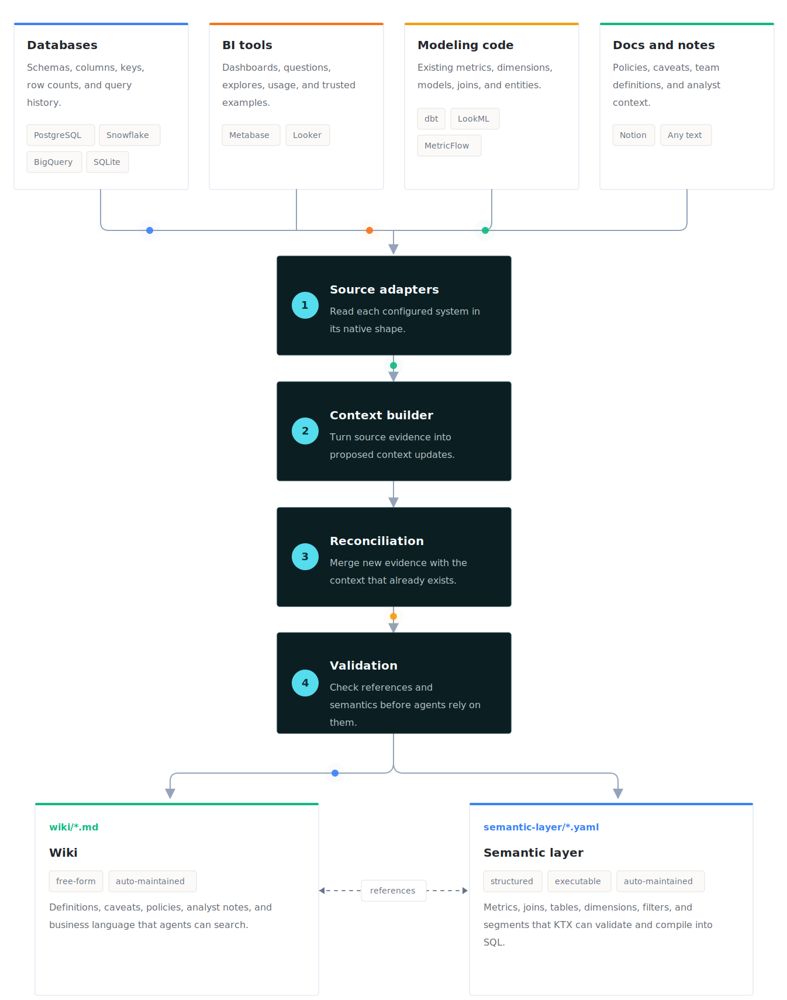
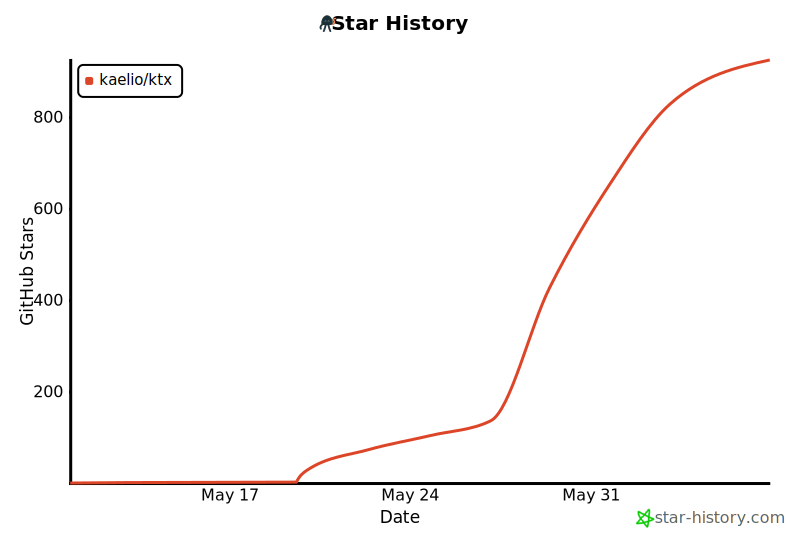

<h1 align="center">
  
</h1>

<h1 align="center">
  The context layer for data agents
</h1>

<p align="center">
  <a href="https://www.npmjs.com/package/@kaelio/ktx"></a>
  <a href="https://codecov.io/gh/Kaelio/ktx"></a>
  <a href="https://github.com/Kaelio/ktx/actions/workflows/ci.yml?query=branch%3Amain"></a>
  <a href="https://docs.kaelio.com/ktx/docs/"></a>
  <a href="https://join.slack.com/t/ktxcommunity/shared_invite/zt-3y9b44m1x-LVyNNJD5nwaZHq4XS29LMQ"></a>
  <a href="https://github.com/Kaelio/ktx/blob/main/LICENSE"></a>
  <a href="https://www.ycombinator.com/companies?batch=P25"></a>
</p>

<p align="center">
  <a href="https://docs.kaelio.com/ktx/docs/getting-started/quickstart"><b>Quickstart</b></a> ·
  <a href="https://docs.kaelio.com/ktx/docs/cli-reference/ktx"><b>CLI Reference</b></a> ·
  <a href="https://docs.kaelio.com/ktx/docs/ai-resources/agent-quickstart"><b>Agent Setup</b></a> ·
  <a href="https://join.slack.com/t/ktxcommunity/shared_invite/zt-3y9b44m1x-LVyNNJD5nwaZHq4XS29LMQ"><b>Slack</b></a>
</p>

---

**ktx** is a self-improving context layer that teaches agents how to query your
warehouse accurately - from approved metric definitions, joinable columns, and
business knowledge it builds and maintains for you.

> [!NOTE]
> Run **ktx** with your own LLM API keys or a **Claude Pro/Max** subscription.
> No extra usage billing from **ktx**.

<p align="center">
  
</p>

## Why ktx

General-purpose agents struggle on data tasks. They re-explore your warehouse
on every question, invent their own metric logic, and return numbers that
don't match approved definitions.

Traditional semantic layers don't fix this. They demand constant manual
upkeep and don't absorb the rest of your company's knowledge.

**ktx** does both, automatically:

- **Learns from company knowledge.** Ingests wiki content, organizes it,
  removes duplicates, and flags contradictions for human review.
- **Maps the data stack.** Samples tables, captures metadata and usage
  patterns, detects joinable columns, and annotates sources so agents write
  better queries.
- **Builds a semantic layer.** Combines raw tables and high-level metrics
  through a join graph that automatically resolves chasm and fan traps, so
  agents fetch metrics declaratively instead of rewriting canonical SQL each
  time.
- **Serves agents at execution.** Exposes CLI and MCP tools with combined
  full-text and semantic search across wiki and semantic-layer entities.

## How ktx compares

|  | General-purpose agent | Traditional semantic layer | **ktx** |
| --- | :---: | :---: | :---: |
| Builds warehouse context automatically | — | — | ✓ |
| Detects joinable columns + resolves fan/chasm traps | — | Manual | ✓ |
| Approved, reusable metric definitions | — | ✓ | ✓ |
| Absorbs wiki / Notion / team knowledge | — | — | ✓ |
| Flags contradictions across sources | — | — | ✓ |
| Ships CLI + MCP for agent execution | Partial | — | ✓ |
| Read-only by design | n/a | n/a | ✓ |

## Who is ktx for

**Use ktx if you:**

- Want agents like Claude Code, Codex, Cursor, or OpenCode to query your
  warehouse with approved metric definitions
- Have business knowledge scattered across dbt, Looker, Metabase, Notion, and
  team wikis
- Need agents to reuse canonical SQL instead of inventing it on every prompt

**Skip ktx if you:**

- You don't have a SQL warehouse - **ktx** sits on top of one
- You only need one ad-hoc query - `psql` or a notebook will do

Works with PostgreSQL, Snowflake, BigQuery, ClickHouse, MySQL, SQL Server, and
SQLite. Integrates with dbt, MetricFlow, LookML, Looker, Metabase, and Notion.

## Quick Start

```bash
npm install -g @kaelio/ktx
ktx setup
ktx status
```

`ktx setup` creates or resumes a local **ktx** project, configures providers
and connections, builds context, and installs agent integration.

Example `ktx status` after setup:

```text
ktx project: /home/user/analytics
Project ready: yes
LLM ready: yes (claude-sonnet-4-6)
Embeddings ready: yes (text-embedding-3-small)
Databases configured: yes (warehouse)
Context sources configured: yes (dbt_main)
ktx context built: yes
Agent integration ready: yes (codex:project)
```

> [!TIP]
> Already using an agent? Ask Claude Code, Codex, Cursor, or OpenCode from
> your project directory:
>
> ```text
> Run npx skills add Kaelio/ktx --skill ktx and use the ktx skill to install
> and configure ktx in this project.
> ```

> [!IMPORTANT]
> If `ktx status` prints `ktx mcp start --project-dir ...`, run it before
> opening your agent client.

## First commands

| Command | Purpose |
| --- | --- |
| `ktx setup` | Create, resume, or update a **ktx** project |
| `ktx status` | Check project readiness |
| `ktx ingest` | Build context for every configured connection |
| `ktx sl "revenue"` | Search semantic sources |
| `ktx wiki "refund policy"` | Search local wiki pages |
| `ktx mcp start` | Start the MCP server for agent clients |

See the [CLI Reference](https://docs.kaelio.com/ktx/docs/cli-reference/ktx)
for every command, flag, and option.

## Project Layout

```text
my-project/
├── ktx.yaml                         # Project configuration
├── semantic-layer/<connection-id>/  # YAML semantic sources
├── wiki/global/                     # Shared business context
├── wiki/user/<user-id>/             # User-scoped notes
├── raw-sources/<connection-id>/     # Ingest artifacts and reports
└── .ktx/                            # Local state and secrets, git-ignored
```

Commit `ktx.yaml`, `semantic-layer/`, and `wiki/`. Keep `.ktx/` local.

Project resolution defaults to `KTX_PROJECT_DIR`, then the nearest `ktx.yaml`,
then the current directory. Pass `--project-dir <path>` when scripting.

## FAQ

- **Does ktx send my schema or query results to a hosted service?**
  No. **ktx** runs locally. The only data leaving your machine is what you
  send to the LLM provider you configured.
- **Which LLM backends are supported?**
  Anthropic API, Google Vertex AI, AI Gateway, and the local Claude Code
  session through the Claude Agent SDK. See
  [LLM configuration](https://docs.kaelio.com/ktx/docs/guides/llm-configuration).
- **How is ktx different from a dbt or MetricFlow semantic layer?**
  **ktx** *ingests* those layers and combines them with raw-table
  introspection and wiki content. Agents get one searchable surface instead
  of three disconnected ones - and **ktx** flags contradictions across
  sources.
- **Does ktx need a running server?**
  There is no hosted service. The local MCP daemon runs on demand via
  `ktx mcp start` when an agent client needs it.
- **Is my warehouse safe?**
  Yes. Connections are read-only - **ktx** never writes to your database.

## Docs

- [Quickstart](https://docs.kaelio.com/ktx/docs/getting-started/quickstart)
- [The Context Layer](https://docs.kaelio.com/ktx/docs/concepts/the-context-layer)
- [Building Context](https://docs.kaelio.com/ktx/docs/guides/building-context)
- [CLI Reference](https://docs.kaelio.com/ktx/docs/cli-reference/ktx)
- [Agent Quickstart](https://docs.kaelio.com/ktx/docs/ai-resources/agent-quickstart)
- [Community & Support](https://docs.kaelio.com/ktx/docs/community/support)

## Community

- **[Slack](https://join.slack.com/t/ktxcommunity/shared_invite/zt-3y9b44m1x-LVyNNJD5nwaZHq4XS29LMQ)** — ask questions, share what you're building, and chat with maintainers.
- **[GitHub Issues](https://github.com/Kaelio/ktx/issues)** — report bugs and request features.
- **[Contributing](https://docs.kaelio.com/ktx/docs/community/contributing)** — set up the repo, run tests, and open a PR.

## Development

```bash
git clone https://github.com/kaelio/ktx.git
cd ktx
pnpm install
uv sync --all-groups
pnpm run build
pnpm run check
```

**ktx** is a pnpm + uv workspace:

| Path | Purpose |
| --- | --- |
| `packages/cli` | TypeScript CLI and published npm package source |
| `packages/cli/src/context` | Core context engine |
| `packages/cli/src/llm` | LLM and embedding providers |
| `packages/cli/src/connectors` | Database scan connectors |
| `python/ktx-sl` | Semantic-layer query planning |
| `python/ktx-daemon` | Portable compute service |

Local development CLI:

```bash
pnpm run setup:dev
pnpm run link:dev
ktx-dev --help
```

Useful checks:

```bash
pnpm run type-check
pnpm run test
pnpm run dead-code
uv run pytest -q
```

## Telemetry

**ktx** collects anonymous usage telemetry from interactive CLI runs to
improve setup, command reliability, and data-agent workflows. No file paths,
hostnames, SQL, schema names, error messages, or argv are recorded. See
[Telemetry](https://docs.kaelio.com/ktx/docs/community/telemetry) for the
event catalog and opt-out options.

## License

**ktx** is licensed under the Apache License, Version 2.0. See `LICENSE`.

## Star History

<p align="center">
  <a href="https://star-history.com/#Kaelio/ktx&Date">
    
  </a>
</p>
